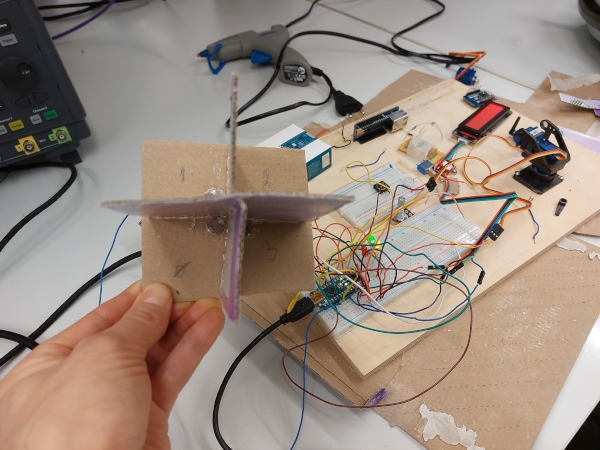

>[!CAUTION]  
>WIP as in Work In Progress
>This warning will be removed only after when this report is finished.  

<p align="center">
  
</p>

<p align="center">
More chaos, more creativity? 
</p>

# Arduino based dual axis solar tracker ☀️

This Arduino nano based project uses light depended resistors to control and turn two servo motors to the brightest light source.

## Tools
- Laptop for programming
- Soldering iron
- Phillips head screwdrivers
- Hot glue gun
- Scissors

## Parts and materials

- Cardboard

## Arduino nano
 - Arduino nano
 - USB-A (male) to micro-USB (male) cable for programming
 - Arduino IDE software for programming

## LDRs and resistors

Four LDRs (ohm?) are installed with resistors...

## Servo motors

Project utilizes two [DMS-MG90 micro servos](https://www.dfrobot.com/product-1338.html). Scroll page down for the specifications. [Motor dimensions](https://github.com/Arduinolibrary/DFRobot_DMS_MG90/blob/master/DMS-MG90%20Servo%20Dimension.pdf) at GitHub.

## LEDs

There are three LEDs to indicate solar tracker status. Each one has properly sized current limiting resistor.
>[!CAUTION]
> ADD FORMULA FOR SIZING CURRENT LIMITING RESISTOR HERE!!      

 - 🟢 Green LED lights on when the system initialized and running.
 - 🔴 Red LED is blinking when the system is tracking for the best light source.
 - 🟢🟡 Both green and yellow LEDs are lit simultaneously when the light source tracking is optimal. 

## Button for ISR
- Microswitch push button
- Resistor and a capacitor for debouncing??? 

## ISR Interrupt Service Routine reset

System can be resetted and initialized to start by pushing button for three seconds period.

## Color display (LCD)

System uses [Gravity: I2C 16x2 Arduino LCD with RGB Backlight Display](https://www.dfrobot.com/product-1609.html). Check the [Documentation at GitHub](https://github.com/DFRobot/DFRobot_RGBLCD1602).

Both `LDR raw values` and `LDR percentual values` are printed out (3 seconds at the time?) on the LCD screen.  

### Help?
(LCD shows system status and help every time system starts??)

## Connections

## Code

## Angle limits considerations in Finland for the servos

Angle limits are considered by the installation location of the solar tracker. The latitude of Finland ranges from approximately 60°N in the south to over 70°N in the north. This high latitude means that the sun is low on the horizon for much of the year, particularly during winter months comparing to summer. ```In Finland there isn't too much solar energy harvested In the winter time``` Check the [Fingrid statistics](https://www.fingrid.fi/en/electricity-market-information/solar-power) for the annual solar power generation in Finland.     

Latitude Range: 
 
    Southern Finland (e.g., Helsinki at about 60°N): The sun's maximum elevation angle can reach up to approximately 52.5 degrees in summer and as low as around 7 degrees in winter.
    Northern Finland (e.g., Rovaniemi at about 66.5°N): The sun's maximum elevation angle is much lower, reaching around 30 degrees in summer and barely rising above the horizon in winter.

Vertical Angle Limits:

    Summer: In southern parts of Finland, servomotors should be able to adjust between roughly 7 degrees (during sunrise) to about 52-53 degrees (at solar noon during the summer solstice).
    Winter: The vertical range is much smaller due to the low sun angle. In southern Finland, this might be from just above the horizon (~7 degrees) to around 15-20 degrees.